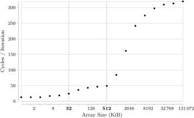
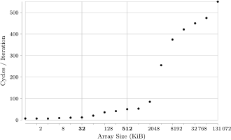

# jai-cache-survey

Jai implementation of this [CPU cache survey](https://meribold.org/2017/10/20/survey-of-cpu-caches/).

## Usage

Build with

```
jai -import_dir modules main.jai
```

Then run `./main`. On my system I get:

```
000001 KiB cycles per iteration = 004
000002 KiB cycles per iteration = 004
000004 KiB cycles per iteration = 004
000008 KiB cycles per iteration = 008
000016 KiB cycles per iteration = 010
000032 KiB cycles per iteration = 011
000064 KiB cycles per iteration = 022
000128 KiB cycles per iteration = 035
000256 KiB cycles per iteration = 041
000512 KiB cycles per iteration = 050
001024 KiB cycles per iteration = 051
002048 KiB cycles per iteration = 074
004096 KiB cycles per iteration = 232
008192 KiB cycles per iteration = 354
016384 KiB cycles per iteration = 424
032768 KiB cycles per iteration = 450
065536 KiB cycles per iteration = 486
131072 KiB cycles per iteration = 478
```

If you have `pdflatex` installed, you will also get a PDF with a chart, and on Linux also a `.svg`.

Here is a chart from a machine with 32 KiB L1 cache and 256 KiB L2 cache per core:



Here is a chart from a machine with 64 KiB L1 cache and 512 KiB L2 cache per core:


